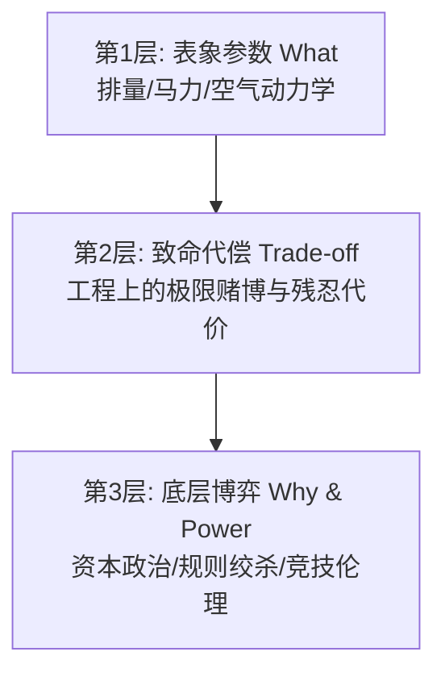

# ErChuang 爆款叙事与深度剖析核心剧作规范

> 针对抖音横屏二创“故事平淡、2秒跳出率高、完播率低、偏说明书流水账、缺乏深度分析”的专项剧作标准。
> 任何 Agent 在生成或改写二创脚本（manifest chunks）前，**必须严格遵照本规范执行**。

---

## 1. 黄金 2 秒开局神经机制（0~2s 铁律）

抖音用户滑动视频的决策时间仅为 **0.3 ~ 1.5 秒**。前两秒的核心任务不是交代背景，而是**在用户大脑皮层制造强烈的生理级认知冲击**。

### 1.1 绝对禁止清单（开篇 2 秒四大红线）
1. ❌ **严禁赛事缩写与圈内黑话**：严禁用“IMSA、WSC、Group C、LMGT1”等词汇起手。大众听不懂，立即滑走。
2. ❌ **严禁年份与时代背景起手**：严禁“上世纪八十年代末的一天……”、“一九八二年，新规落地……”等纪录片老套开头。
3. ❌ **严禁战绩与奖项报菜名**：严禁“三个IMSA冠军，五个WSC冠军，六个勒芒总冠军……”式自我感动。
4. ❌ **严禁前 3 秒揭秘答案**：严禁在第一句直接报出车名（如“这台车叫TS010”、“它就是保时捷962”）。谜底一旦过早揭晓，用户的探索冲动瞬间清零。

### 1.2 三大反常识爆点模型（开篇强制 3 选 1）
每个二创脚本的第一句话（Chunk 0），必须严格属于以下三种模型之一：

| 模型 | 核心公式 | 适用题材 | 经典范例 |
| :--- | :--- | :--- | :--- |
| **模型 A：荒谬漏洞与作弊反杀（Paradox）** | `[极度违背直觉的荒谬行为] + [不可思议的戏剧化后果]` | 钻规则空子、街车套壳、奇葩设计 | *“保时捷为了赢勒芒，居然在纯种赛车里硬塞了个后备箱和真皮座椅，假装成买菜街车，反手把全场的千万级超跑全干趴了！”* |
| **模型 B：生理极限与惨烈代价（Visceral Shock）** | `[残酷生理代价/破坏力] + [工程师近乎病态的执念]` | 极端性能、危险怪兽、下压力猛兽 | *“车手只开了一圈，肋骨当场被震断两根。这台把活人当易耗品的丰田怪兽，刚一出世，把国际汽联吓得连夜修改规则！”* |
| **模型 C：降维打击与规则反杀（Underdog Inversion）** | `[极不起眼的小排量/民间队] + [干翻百年豪门逼停整个赛事]` | 小打大、平民逆袭、四缸打V12 | *“一台排量只有两升的小四缸，居然把保时捷、捷豹这些厂队巨头按在地上摩擦，最后逼得赛事方直接把整个比赛取消！”* |

---

## 2. 五步戏剧张力弧线（The 5-Act Tension Curve）

彻底打破“时间轴单向流水账”，全片按照好莱坞三幕剧与短视频心流模型编排：

```
[第1幕·0~5s] 黄金核爆悬念（立下大悬念，锁死划屏）
     ↓
[第2幕·5~25s] 绝境高墙（资本绞杀、规则杀人、生存危机）
     ↓
[第3幕·25~60s] 致命工程下潜（深挖Why：不为人知的工程代偿与技术赌博）
     ↓
[第4幕·60~90s] 正赛命运过山车（绝地缠斗、机械极限、惊天意外）
     ↓
[第5幕·90s+] 哲学反思与评论区点火（规则伦理，争议收口）
```

- **第 1 幕·核爆悬念**：只抛出违背常理的结局或现象，坚决不揭开底层机理，立下全片主悬念（Macro Loop）。
- **第 2 幕·绝境高墙**：把反派与不可抗力具象化。不仅要讲“规则改了”，更要讲清“背后的资本围剿与绝境逼迫”（如国际汽联为了拯救 F1 强行扼杀 Group C，车企数亿预算沦为废铁，生死存亡）。
- **第 3 幕·致命工程下潜**：核心深度区。讲清工程师如何“把灵魂卖给魔鬼”换取性能，详见第 3 节三层下潜模型。
- **第 4 幕·正赛命运过山车**：比赛不是轻描淡写，必须体现极端条件下的戏剧冲突（如对手连杆突然断裂、自身传动轴报警、进站算盘博弈）。
- **第 5 幕·哲学反思与点火**：拒绝鸡汤与平淡总结，上升到规则伦理与工业思考，抛出让评论区对立争论的问题。

---

## 3. 深入分析「三层下潜模型」（Deep-Insight Engine）

写技术解析时，**严禁停留在表象参数**。每一处核心机械设计必须强制下潜至第 2、第 3 层：



### 3.1 下潜转化范例

1. **地面效应与悬挂**：
   - *表象层（禁止写法）*：“地面效应底盘，配巨型尾翼，下压力巨大，百公里加速三秒内。”（说明书）
   - *下潜层（标准写法）*：“地面效应最大的噩梦是气流密封：只要底盘漏进一点空气，整台车就会瞬间起飞解体。为了保命，工程师把悬挂彻底锁死——整台车几乎没有减震。每一次过弯，车手都是用自己的骨肉硬抗 4G 的地表重击！”（讲透物理机理与生理代价）
2. **规则限制下的性能权衡**：
   - *表象层（禁止写法）*：“平底板窄轮胎牺牲了下压力，排位赛慢了20秒。”（纯陈述）
   - *下潜层（标准写法）*：“为了符合街车标准，底盘被强制削平，弯道慢了整整二十秒！慢成这样怎么赢？保时捷彻底放弃弯道，利用涡轮暴力在直道上狂飙，再塞进一百二十升超大油箱，在算盘上跟对手死磕进站次数！”（讲透战术代偿）
3. **规则更改的背景**：
   - *表象层（禁止写法）*：“1991年规则改变，Group C被废除，迎来了GT1。”（流水账）
   - *下潜层（标准写法）*：“为什么新规突然杀死勒芒？因为国际汽联眼红勒芒收视率压过F1，为了逼各大车企回流F1，联手强推昂贵且脆弱的自吸引擎。这是一场赤裸裸的资本围剿。”（讲清深层权力斗争）

---

## 4. 未闭合悬念链（Open Loops）保完播机制

为了消灭 25 秒、50 秒的注意力断崖，全片实施**嵌套悬念回路**：

1. **主悬念（Macro Loop）**：开篇第一句埋下，直到倒数第 2 段才揭晓结局。
2. **段间微悬念（Micro Loop，每 25~30 秒一个）**：在每一个 chunk 推进时，严禁平顺自然过渡，必须在段尾抛出反直觉的阻碍或未解之谜：
   - “但接下来的车展上，全场同行却当场看傻了眼……”
   - “按常理它在直道上就是个活靶子，但工程师却在油箱上动了一个致命手脚……”
   - “就在所有人以为大局已定的时候，赛车在第18小时却冒起了白烟……”

---

## 5. 语言口播化与节奏要求（配合 Humanizer-Bilibili）

1. **短促有力，撕碎长句**：单句控制在 15~25 字以内，长句拆为主谓宾清晰的紧凑短句。
2. **多用动词与具象名词**：用“撕碎、按在地上摩擦、轰然断裂、魔鬼算盘”替代“产生影响、实现超越、发生故障”。
3. **呼吸感标点**：善用逗号切分节奏，留出 TTS 呼吸间隙（300~400ms）。
4. **年份数字**：所有年份必须写作汉字（如“一九九四年”），以确保 IndexTTS 的准确发音。
